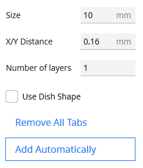

# Tab Anti-Warping Reborn
A continuation of [Tab Anti Warping +](https://github.com/5axes/tabplus) by 5@xes.  
Originally based on the support blocker code in [UltiMaker Cura](https://github.com/ultimaker/cura).

## So what is it?
**Add circular tabs at the corners of your print to help stop them warping!**  
A targeted and more powerful option than just brims.
- Tabs can be really big if you want. Saves you having to run a big brim around your whole print.
- Multiple layers! The additional layers are generated as a support mesh so they're easy to remove.
  - You can control how far from the model they are. Closer = better hold, *slightly* harder removal. But still not too hard.
- Dish shaped tabs are flat on the bottom, but hollow out as they get higher, leaving just the rim.
  - Has plenty of base area so it holds onto the build plate, but still has plenty of contact with the model without having to remove big bits of solid tab.
  - Easier to remove from the build plate by wedging something under them.
  - Easier to remove from the model (especially with less scarring).

And you don't even need to do the hard work because there's a function to add them automatically!

## How do I use it?
#### Install the plugin, select a model, pick the tool from the toolbar on the left:
 <-- That one!
#### Set it up the way you like it:
|||
|-|-|
||**Size:** Diameter of the tab circle in millimetres. **X/Y Distance:** Sets the X/Y distance from the model for multi-layer / dish support. **Number of layers:** How many layers thick a regular tab will be, or adds layers to a dish-shaped tab. **Use Dish Shape:** Enable/disable the dish shaped tabs I explained up in the first section. **Remove All Tabs:** It is *exactly* what it sounds like. **Add Automatically:** Puts tabs on the outside corners of your model. A small menu pops up letting you choose between more tabs which might overlap or less tabs which might miss a corner.|
#### Add tabs:
If you'd rather do things manually, that's cool (and I'm with you about half the time). With a model selected, the tool active and your settings dialed in, just click on your model where you want a tab. It's that easy! You don't even have to click the bottom of it, click anywhere on its height and the tab will be created on the build plate.
#### Remove tabs:
Accidentally click the wrong spot? Change your mind? Want practice placing them? That's fine, with the tool active just click any existing tab and it will be removed. Or with any of Cura's other tools active just click it to select it then press delete. Or for when it doesn't matter what tool you're in, just right click the tab and click *Delete Selected*.
#### Move tabs:
For that you need to use Cura's built in move tool. Just hold Ctrl and click on something and it'll switch you to that. If you use the *Add Automatically* button, that switches to the move tool. Once you're in the move tool, just click and drag them. Or click the tab and some arrows will appear on the tab in the 3D view and you can click and drag those.
## Want to say hi? Got an idea? Found a bug I haven't?
**I want to hear it!** Just swing by the [the GitHub repo](https://github.com/Slashee-the-Cow/TabAntiWarpingReborn) and go to discussions, or issues.
## What are the latest updates?
### v1.0.0: Initial release
#### What's new?
- Automatically adding tabs now has two options: more tabs (which might overlap) or fewer tabs (which might miss some points). On a lot of models it won't make much difference either way. If you're not sure, go for more.
- Input validation in the tool's control panel now tells you if any of your settings are invalid (and won't let you create tabs if they are invalid).
- The control panel should feel a lot more responsive now.
- Error/status messages are more descriptive because I want you to know *why* it's doing something, not just that it is.
- Should stop you creating tabs that would go outside the build area.
#### What's fixed?
- A bunch of bugs.
- You can't try creating a tab with invalid settings now (could cause a crash before).
- The *Remove All Tabs* button should now only remove tabs and not other support meshes (like if you created some with [Custom Supports Reborn](https://github.com/Slashee-the-Cow/CustomSupportsReborn) - shameless plug).
- Redid the internal layout of the user interface so it should handle things like small window sizes better.
- Will no longer create a tab if Cura miscalculates the click position seriously.
- Added more checks to make sure Cura's settings are what they need to be to handle the requirements of some tab settings.
- Optimised the code a little bit where I could.
#### What's different?
- I've updated everything to make sure it works in the latest versions of Cura.
- The "capsule" tab type has been renamed to "dish".
- Renamed everything in the plugin, inside and out. This means you can have this and another version installed side by side if you want.
- Changed the icon in the toolbar so if you have another version installed you can tell them apart.
- Implemented my own notification message system since Cura's seems to make the locations you try and pick go wildly off course.
#### What's gone?
I did take a couple of features out of the previous incarnation.
- Removed support for Qt 5 to reduce maintenance workload. This means the minimum Cura version required is now 5.0.
- Took out the "Set on adhesion area" setting. It was confusing, a little complicated, and I'm not sure it worked that well anyway.
- There were a few post-processing scripts which I don't think Cura could access anyway, and didn't seem particularly useful, so I took those out.
- There are so many changes the translation files would just completely not work, so I took them out. If you want to translate it, get in touch!
## Known Issues?
- The notification system is ugly and primitive. Cura's built in notifications are pretty and smart. Except they seem to break things.
- Changes settings related to support so it's not necessarily appropriate for models that need support.
This is required to make sure the tabs don't become part of the model and are printed before it.
- The *Remove All Tabs* button might not remove all the tabs any more, depending on what's happened since the tabs were created.
This is a side effect of making it not remove support meshes which aren't tabs.
- Sometimes Cura miscalculates the click position for creating a new tab.
I prevented the more extreme circumstances but it can still get it wrong sometimes.
As far as I can tell this is an issue with Cura (though I'd really love it if someone showed me it isn't :D) and not something I can fix on my end.
You can safely delete any tabs in the wrong place.
- It's possible to change settings from the optimal defaults set when creating a tab. Please don't.